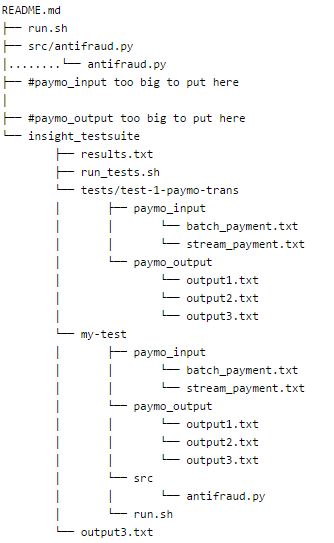

# insight-code-challenge-binayprasai

# Algorithms Used
## Feature 1
This feature checks if A and B are directly related. 
This is done by checking if B is in the list of A's transaction or A in B's transaction.

## Feature 2 
This one checks if B is second degree friend of A i.e. B is a neighbor of at least one of A's neighors. 
Quicker algorithm will be finding A's first degree friends say A1 and B's first degree friends (B1) and check if there are common friends in two friends lists A1 and B1.  
A---[A1 B1]----B  
[   ] means checking intersection (common) ids in [A1 and B1]  

## Feature 3 
This one allows up to four degree of friendship. Feature 1 and Feature 2 are already included here. 
Now to check third and fourth degree of friendship, we find 2nd degree friend of A say A2, and same for B, say B2.   
A---A1---[A2 B1]---B ---> third degree friend  
A---[A1 B2]---B1---B ---> third degree friend  
A---A1---[A2 B2]---B1---B ---> fourth degree friend  

Batch_payment.csv has some lines just text and should be taken care of.   

I am not able to put output files for the stream_payment.csv provided in the dropbox link. Each has 3 million lines.  

My Repo Structure    

 

 
